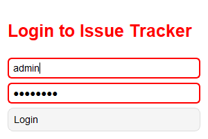
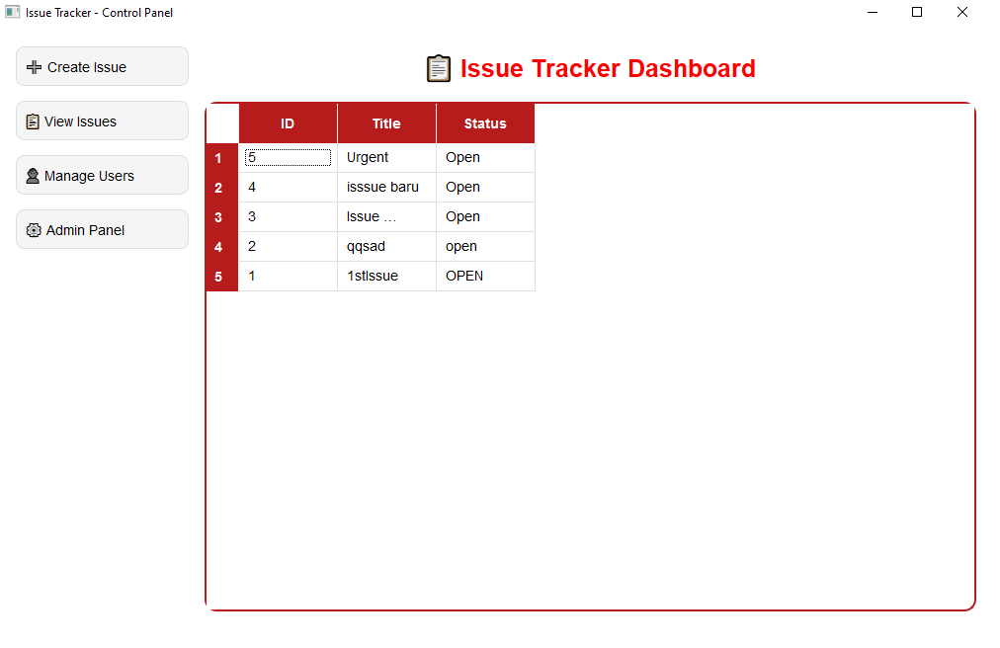
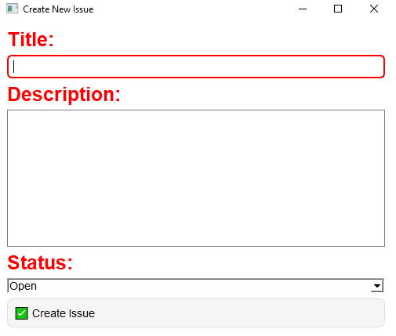
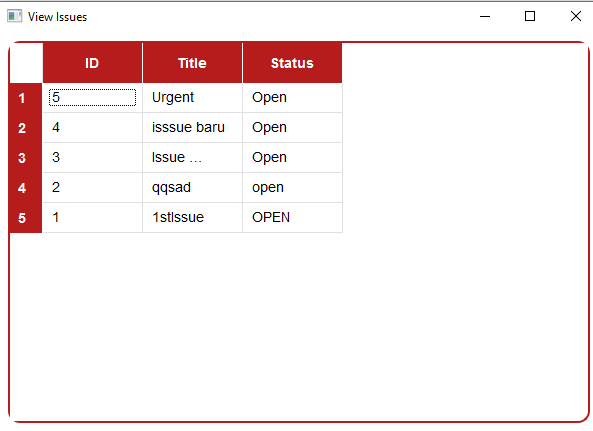

# 📌 Issue Tracker API + AI Prioritizer

This project is a **full-stack Issue Tracker application** with:
- **ASP.NET Core API** (Backend)
- **PySide6 Desktop UI** (Frontend)
- **JWT Authentication with Admin/User Roles**
- **Custom Red & White UI Theme (style.qss)**

---

## 📂 Project Structure
```
project_root/
│
├── api/                      
│   ├── Controllers/
│   │   ├── IssuesController.cs
│   │   └── AuthController.cs   # 🔑 Login/auth controller
│   ├── Models/
│   │   ├── LoginDto.cs         # 🔑 DTO for login payload
│   │   └── User.cs             # Example user model
│   ├── Helpers/
│   │   └── JwtHelper.cs        # 🔑 Helper to issue JWT tokens
│   └── Program.cs / Startup.cs (configure Identity & JWT)
│
├── ui/                        
│   ├── main.py                 # ✅ Entry point, shows login first
│   ├── login_window.py         # 🔑 Login screen (red & white theme)
│   ├── ui_main.py              # ✅ Main dashboard (role-based filtering, table view)
│   ├── view_issues_window.py   # 📋 View Issues UI
│   ├── create_issue_window.py  # ➕ Create Issue UI (with form)
│   ├── controller/
│   │   └── api.py              # 🔗 API service wrapper
│   ├── styles/
│   │   └── style.qss           # QSS theme file (red & white)
│   └── config.json             # API URL and settings
│
└── README.md                   
```

---

## 🚀 Features Implemented
- ✅ JWT Authentication (Admin/User roles)
- ✅ PySide6 Login UI with **red/white theme**
- ✅ Role-based UI filtering (Admin vs User)
- ✅ Configurable API URL via `config.json`
- ✅ **View Issues UI** → fetch & display issues in a modern table
- ✅ **Create Issue UI** → form to add new issues, connected to API
- ✅ **Auto-refresh dashboard** when closing Create Issue UI

---

## 🔮 Future Features (Planned)
- ⏳ **Add User UI**
- ⏳ **Modify User UI**
- ⏳ **Admin View UI**
- ⏳ **Progressive UI Enhancements** (modern layouts, animations, branding)
- ⏳ **AI Prioritizer** → suggest issue priority using simple ML/NLP

---

## ⚙️ Setup Guide

### 1️⃣ Clone Repository
```bash
git clone https://github.com/SteRika/issue-tracker.git
cd issue-tracker
```

### 2️⃣ Run API (ASP.NET Core)
```bash
cd api
dotnet run
```

### 3️⃣ Run UI (PySide6)
```bash
cd ui
pip install -r requirements.txt
python main.py
```

---

## 🖼️ Screenshots

### 🔑 Login UI


### 📋 Dashboard / View Issues


### ➕ Create Issue UI


### 📋 View Issues Window


---

## 📝 Notes
- On **Windows**, run PowerShell or Command Prompt with admin rights if facing permission errors.
- `.vs/`, `bin/`, `obj/`, and `__pycache__/` folders are ignored using `.gitignore`.
- Recommended: use **virtual environment** for Python dependencies.

---

✅ Built with ❤️ by **Steven Lim**
